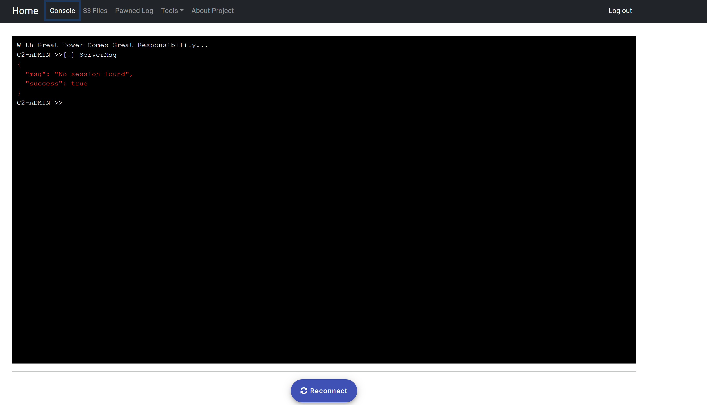
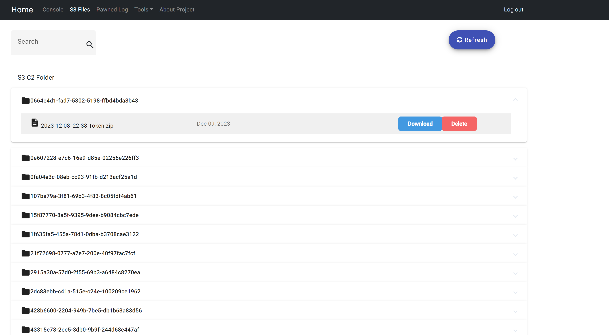
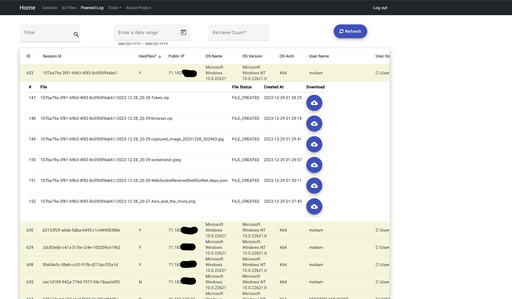

# Angular Project - Command and Control


This Angular project is crafted to oversee compromised computers within a command and control environment. It incorporates Okta authentication, facilitating secure access. The system offers a streamlined process for downloading files that have been exfiltrated from the targets. Additionally, it features a comprehensive log table to record and monitor events. For enhanced control over the botnet, the project includes a user-friendly command line interface.

## Table of Contents
- [Features](#Features)
- [Prerequisites](#prerequisites)
- [Installation](#installation)
- [Usage](#usage)
- [Commands](#commands)
- [C2 Components](#c2-components)

## Features

- **Command Line Interface Emulater**: Facilitates a command-line interface for efficiently managing the botnet fleet.


*C2 CLI*
- **Exfilterated Files Download Component**: Offers a dedicated page for downloading files from compromised computers.


*C2 Compromised Files*
- **Comprehensive Log Table**: Provides a log table to monitor and record the command and control history.


*C2 Log Tables*

## Prerequisites

Before you begin, ensure you have met the following requirements:

- [Node.js](https://nodejs.org/) installed
- [Angular CLI](https://cli.angular.io/) installed globally


## Installation

1. Clone the repository:

    ```bash
    git clone https://github.com/The-Hustler-Hattab/c2-ui.git
    ```

2. Navigate to the project folder:

    ```bash
    cd c2-ui
    ```

3. Install dependencies:

    ```bash
    npm install
    ```

## Usage

To run the project locally, use the following command:

To run the project locally, use the following command:

```bash
ng serve
```
Open your browser and navigate to http://localhost:4200/. The app will automatically reload if you change any of the source files.

## Commands
```ng serve: Start the development server.
ng build: Build the project for production.
ng test: Run unit tests.
ng e2e: Run end-to-end tests.
```
## c2-components

[C2 UI](https://github.com/The-Hustler-Hattab/c2-ui)  
[C2 Server](https://github.com/The-Hustler-Hattab/C2JavaServer)   
[C2 Java Agent](https://github.com/The-Hustler-Hattab/ReverseShellWebSocketAgent)  
[C2 C# .NET Agent (RECOMMENDED)](https://github.com/The-Hustler-Hattab/WebSocketReverseShellDotNet)  

## Contributing
Contributions are welcome!
Please make a pull request for new features  
